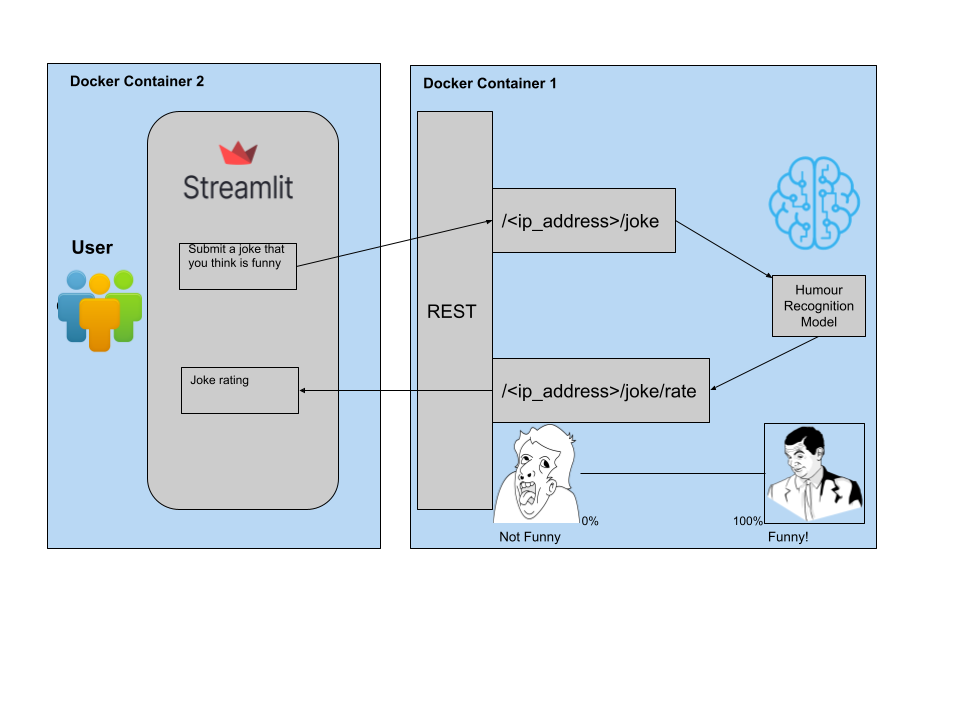
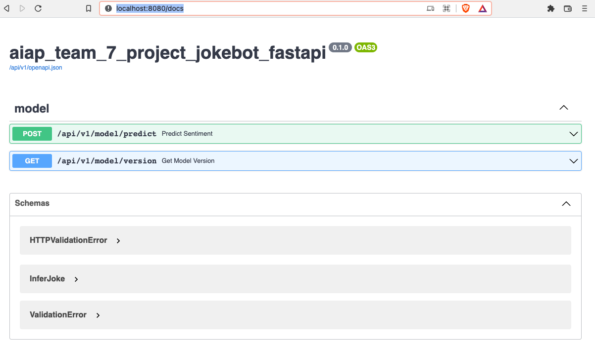
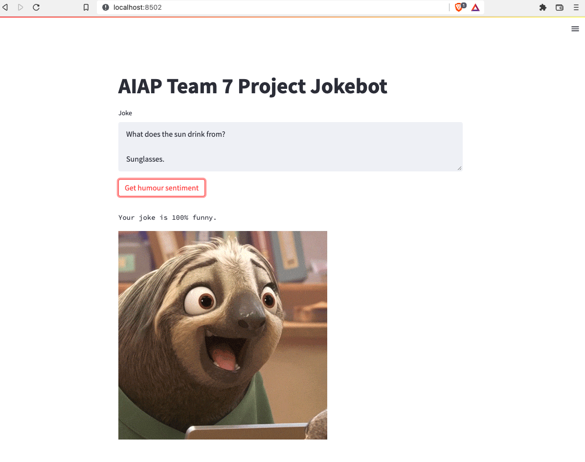

# Project Jokebot
Project jokebot is a simple web-based application (using streamlit app) where it allows aspiring comedians to understand the 'joke rating' of their jokes.


## Table of content

- [Pipeline](#pipeline)
- [Deployment](#deployment)
    - [Prerequisites](#prerequisites)
    - [Running locally](#running-locally)
    - [To run frontend](#to-run-frontend)
    - [To run backend](#to-run-backend)
    - [Running locally via Docker Images](#running-locally-via-docker-images)
    - [Running on GKE](#running-on-gke)
- [References](#references)
- [Contributors](#contributors)

## Demonstration


 ## Pipeline
 

## Deployment
### Prerequisites
- miniconda or conda installed
- pre-trained model downloaded into models directory

### Setup conda environment
From project root directory:
```
conda env create -f project_requirements.yml
```
To update conda env with subsquent changes to .yml, run:
```
conda env update --name project-requirements --file project_requirements.yml --prune
```

### Download pre-trained model
download the model [here](https://mega.nz/folder/MmB1gIIT#8ilUTK1-BO80aoXxKOIhpg). unzip and place the folder "colbert-trained" under models(add "models" folder as well) in root directory of project, like so:
```
project-jokebot
        .
        .
        .
        |__scripts
        |__models
            |__colbert-trained
        |__src
        .
        .
        .
```

taken from: https://github.com/Moradnejad/ColBERT-Using-BERT-Sentence-Embedding-for-Humor-Detection
### Deployment stages

- Running locally
- Running local docker images
- Running on GKE

#### Running locally
Our project runs the frontend on streamlit and backend on fastapi.

#### prepare environment variables
From project's root directory:
```
export PRED_MODEL_PATH=$PWD/models/colbert-trained && \
export PRED_MODEL_UUID="colbert-trained"
```

#### To run backend
From project's root directory:
```
cd src
gunicorn aiap_team_7_project_jokebot_fastapi.main:APP -b 0.0.0.0:8080 -w 2 -t 600 -k uvicorn.workers.UvicornWorker
```
to access FastAPI's docs, simply go to [here](http://localhost:8080/docs)(in your browser)


#### To run frontend
From project's root directory:
```
streamlit run src/streamlit.py             
```
you should see a local web server opened in your browser like so:



### Running locally via Docker Images
before we deploy our applications on the cloud, we package scripts and modules as two seperate docker images. one to handle fronend user interface and another to another /predict requests coming from frontend

### Running on GKE
after building docker image, and pushed to cloud(GCP. We deploy these containers on GKE. This was only possible given that a GKE cluster was allocated during the course of our mini project. However, it is possible to modify, build, push and deploy these containers on a linux VM elsewhere.    


## References
-  [cookie cutter template](https://github.com/aimakerspace/ml-project-cookiecutter-gcp/blob/master/README.md) -  template consisting of boilerplate codes and well-written docs with instructions on how to use.

- [Humor recognition using deep learning](https://aclanthology.org/N18-2018.pdf)
- [colBERT using BERT Sentence Embedding for humour detection](https://github.com/Moradnejad/ColBERT-Using-BERT-Sentence-Embedding-for-Humor-Detection) 
## Contributors
- Benjamin
- [Chong Junn](https://github.com/chongjunn-tech)
- [Guoren](https://github.com/nguoren)
- [Jian Kai](https://github.com/jiankaig)


